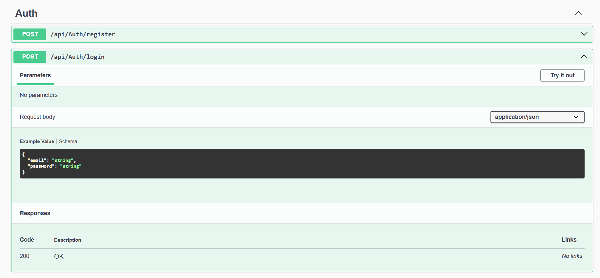
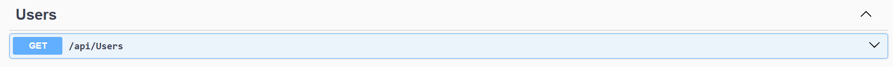
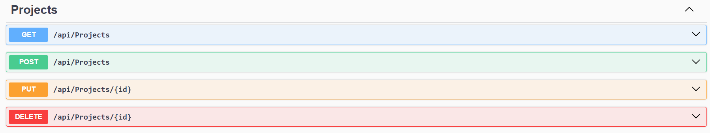
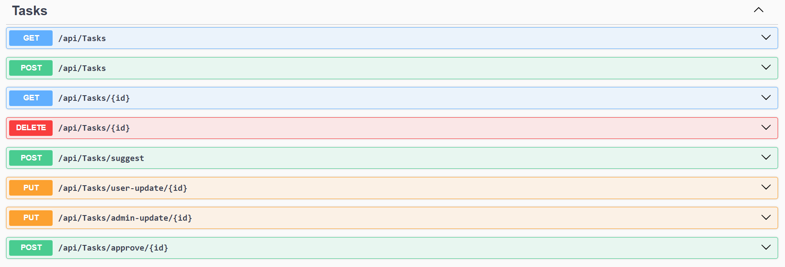
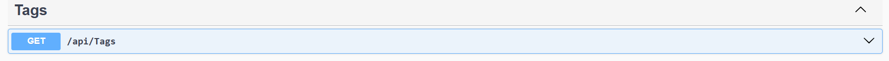
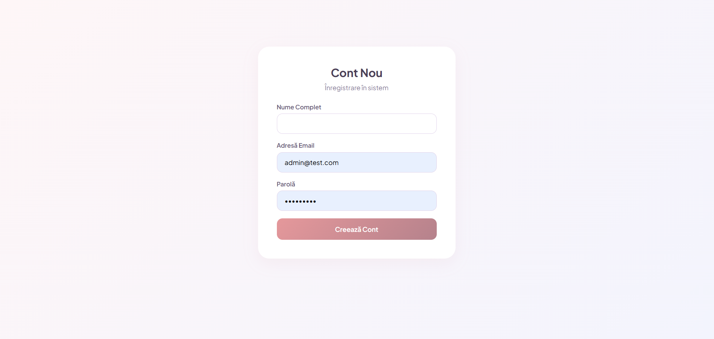
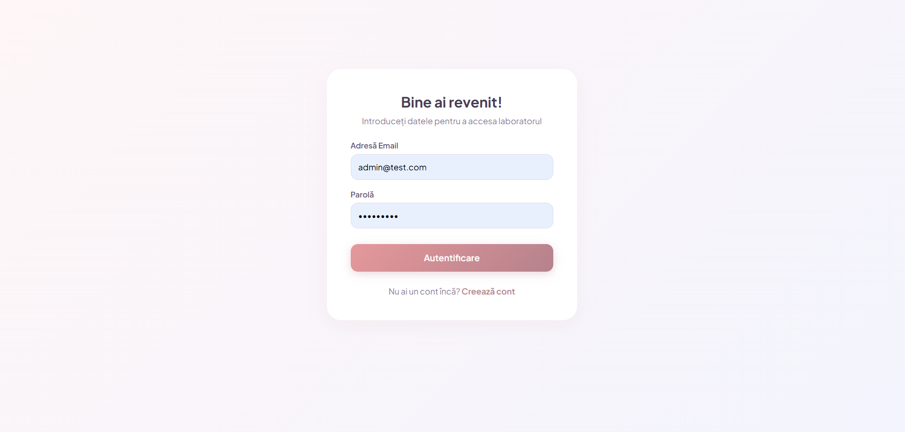
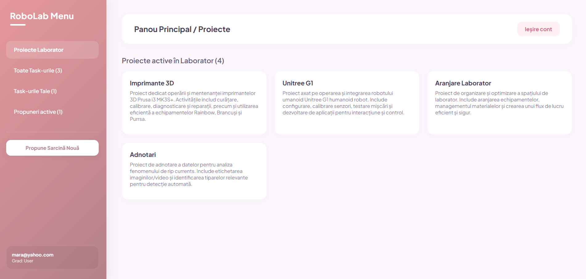
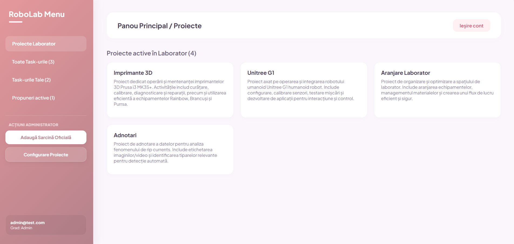

# TaskManager

Sistem de management al activitatilor si task-urilor pentru laboratorul de robotica, structurat intr-o arhitectura de tip Monorepo cu Backend in .NET Core Web API si Frontend in React (Vite).

## 1. Descriere proiect
TaskManager este o aplicatie web conceputa pentru gestionarea eficienta a task-urilor din cadrul laboratorului de robotica. Sistemul permite coordonarea fluxului de lucru intre administratori si utilizatori (studenti), oferind controlul asupra starii si permisiunilor de editare ale activitatilor.

**Functionalitati principale:**
* **Autentificare si autorizare:** Acces securizat pe baza de roluri (Admin, User, Vizitator) implementat prin token-uri JWT.
* **Managementul task-urilor:** Administratorii pot crea, aloca, aproba si sterge task-uri, avand drepturi depline de editare.
* **Filtrare inteligenta:** Utilizatorii logati pot vizualiza separat istoricul global al laboratorului si task-urile alocate strict profilului lor (pe baza ID-ului unic).
* **Flux de aprobare si securitate la nivel de server:** Utilizatorii simpli pot propune task-uri noi (care raman in asteptare pana sunt aprobate de Admin) si pot schimba exclusiv statusul task-urilor oficiale care le-au fost alocate direct. Orice tentativa de modificare a descrierii sau a task-urilor straine este blocata la nivel de backend.

---

## 2. Instructiuni de rulare

### Inainte de rulare
Sunt necesare urmatoarele instrumente instalate pe masina locala:
* .NET SDK (Versiunea 8 sau superioara)
* Node.js si NPM
* SQL Server (LocalDB sau o instanta activa de baza de date)

### Pornire Backend (.NET Core Web API)
1. Se deschide un terminal in folderul dedicat componentelor de backend (unde se afla fisierul `.sln` sau `.csproj`).
2. Se verifica si se configureaza sirul de conexiune (ConnectionString) in fisierul `appsettings.json`.
3. Se ruleaza urmatoarele comenzi pentru compilare si pornire:
```bash
dotnet build
dotnet run
```
Serverul porneste in mod implicit pe porturile http://localhost:5000 sau https://localhost:5001

### Pornire Frontent (React + Vite)
1. Se deschide un terminal separat in folderul dedicat componentelor de frontend.

2. Se ruleaza urmatoarele comenzi pentru instalarea dependentelor si lansarea aplicatiei:

```bash
npm install
npm run dev
```
Aplicatia devine accesibila in browser la adresa afisata in terminal (in mod implicit http://localhost:5173).

## 3. Structura Proiectului si Tehnologii
### Tehnologii utilizate
- Backend: C# .NET 8 Web API, Entity Framework Core, SQL Server, JWT Authentication.
- Frontend: React.js, Vite, Axios (pentru comunicarea cu API-ul), React Router (pentru navigare).

### Structura folderelor (Monorepo)
- /backend - Contine controllerele, serviciile, dto-urile si logica bazei de date (Repository Pattern).

- /frontend - Contine componentele React, paginile (Login, Register, Home etc.) si configuratia Axios.

### Date pentru testare rapida
Dupa initializarea bazei de date, autentificarea in interfata grafica se poate realiza folosind urmatoarele conturi implicite:

- Cont Administrator: admin@test.com (Are drepturi complete de editare si alocare).

- Cont Utilizator (Student): mara@yahoo.com (Are dreptul sa modifice doar statusul propriilor task-uri si sa propuna task-uri).

---

## 4. Documentatie API (Swagger)

Aplicatia backend are integrat Swagger UI pentru documentarea si testarea rapida a tuturor endpoint-urilor disponibile. Dupa pornirea serverului, interfata poate fi accesata la adresa: `http://localhost:5000/swagger` (sau portul corespunzator configurat).

Mai jos sunt prezentate categoriile principale de operatii si metodele HTTP aferente (GET, POST, PUT, DELETE):

### Autentificare (Auth)
Gestionarea crearii de conturi noi si securizarea sesiunilor prin token-uri JWT.


### Management Utilizatori (Users)
Preluarea profilului si identificarea utilizatorilor din baza de date.


### Proiecte (Projects)
Crearea si vizualizarea laboratoarelor sau proiectelor mari.


### Task-uri (Tasks)
Gestionarea activitatilor, alocarea lor, modificarea statusurilor si fluxul de aprobare.


### Tag-uri (Tags)
Categorisirea task-urilor pe baza unor etichete specifice.



## 5. Ghid de Utilizare a Interfeței (UI)

Aplicația oferă o interfață intuitivă (RoboLab Menu) adaptată dinamic în funcție de rolul utilizatorului autentificat. Trecerea de la un ecran la altul se face prin meniul lateral stâng, unde sunt afișate statusul curent și numărul de activități.

### Autentificare și Înregistrare

Înainte de a accesa panoul principal, utilizatorii trebuie să treacă prin sistemul de autentificare securizat:

##### REGISTER 

* Permite studenților noi din laborator să își creeze un cont în platformă.
* Formularul colectează datele de bază (Nume, E-mail, Parolă). 
* În mod implicit, toate conturile noi create din această interfață primesc automat rolul de **User** (Vizitator/Student).



##### LOGIN

* Permite utilizatorilor existenți (Admini sau Studenți) să se conecteze introducând e-mailul și parola.
* În urma validării credențialelor de către backend, utilizatorul primește un token JWT și este redirecționat automat către panoul principal corespunzător rolului său.
* Conține un link rapid către pagina de înregistrare pentru conturile noi.



### Interfața Utilizatorului (User)
În partea stângă jos a meniului lateral este afișat e-mailul utilizatorului curent și gradul său (`Grad: User`). 
* Utilizatorul are acces la secțiunea **Proiecte Laborator**, unde vede cardurile cu proiectele active din cadrul RoboLab (*Imprimante 3D*, *Unitree G1*, *Aranjare Laborator*, *Adnotari*).
* Prin **Toate Task-urile** are acces la vizionarea task-urilor tuturor membrilor.
* Prin **Task-urile Tale** sunt afisate task-ulrile la care este assignat userul.
* La sectiunea **Propuneri active**, apar propunerile care au fost postate de toti userii.
* Din secțiunea **Propune Sarcină Nouă**, utilizatorul poate trimite idei sau task-uri către aprobarea administratorilor.


### Interfața Administratorului (Admin)
Când autentificarea se face cu un cont de Admin, meniul lateral și acțiunile se extind:
* Secțiunea **Propuneri active** colectează toate cererile trimise de către studenți, oferind opțiuni rapide de aprobare sau respingere.
* Administratorul poate gestiona direct colecția de proiecte active afișate pe ecranul principal. Poate sa adauge sau sa stearga proiecte.

